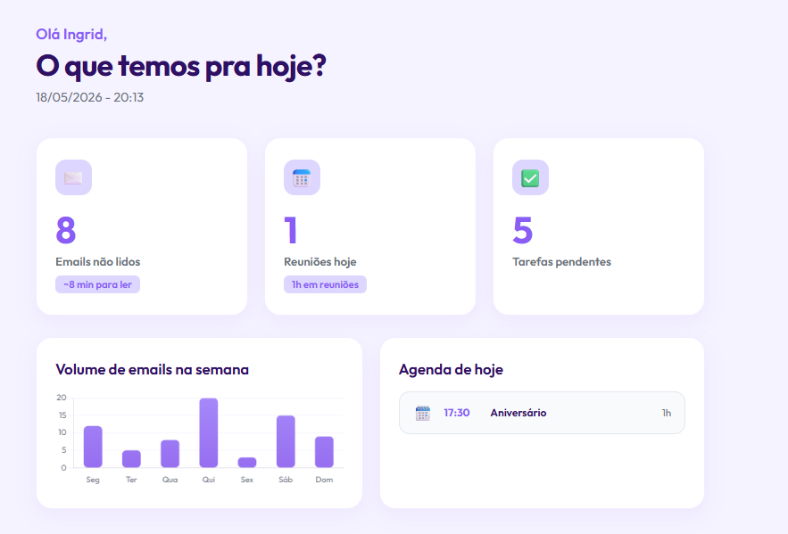

# Sprint IA - Programaria 
## Dashboard com Integração do Gmail e Google Calendar

Um dashboard diário moderno, responsivo e integrado às APIs do Google (Gmail e Google Calendar). Ele ajuda a organizar o começo do dia mostrando a quantidade de emails não lidos, reuniões agendadas para o dia e algumas métricas rápidas, com foco em uma rotina mais produtiva.

## ✨ Funcionalidades
- **Integração com o Google**: Autenticação segura usando *Google Identity Services*.
- **Caixa de Entrada (Gmail)**: Conta os emails não lidos e estima o tempo necessário para leitura.
- **Agenda do Dia (Google Calendar)**: Lista os eventos e reuniões agendadas para o dia atual com cálculo dinâmico de tempo ocupado.
- **Design Moderno**: Interface limpa, responsiva e agradável com um tema em tons de roxo, utilizando a fonte *Outfit*.
- **Acesso Fácil**: O usuário faz o login apenas quando necessário, sem armazenar dados sensíveis.

## 🛠️ Tecnologias Utilizadas
- **Frontend**: HTML5, CSS3, JavaScript (Vanilla).
- **Gráficos**: [Chart.js](https://www.chartjs.org/).
- **Serviços do Google**:
  - Gmail API
  - Google Calendar API
  - Google Identity Services (OAuth2)
- **Ferramentas**: IA Antigravity integrada ao VS Code

## 🚀 Acesse o Dashboard
  👉 **[http://localhost:8000/dashboard.html](http://localhost:8000/dashboard.html)**

  

## ⚙️ Como testar localmente
As APIs do Google possuem regras rígidas de segurança e **não funcionam** ao simplesmente abrir o arquivo HTML no navegador (`file:///`). Para testar na sua máquina:

1. Clone este repositório.
2. Abra a pasta no VS Code.
3. Instale a extensão **Live Server**.
4. Clique com o botão direito em `dashboard.html` → **Open with Live Server**.
5. O projeto abrirá em algo como `http://localhost:8000/dashboard.htm`.

---

## 📚 Sobre o projeto
Este projeto foi desenvolvido como parte da **Sprint IA** do programa de formação em desenvolvimento web da **Programaria**.  
Utilizamos a plataforma **Antigravity** como agente de desenvolvimento integrado ao VS Code.  

A instrutora **Gabriela Surita** disponibilizou orientações em seu GitHub:  
👉 [Curso Vibecoding](https://gabisurita.github.io/gabisurita/courses/vibecoding/)

